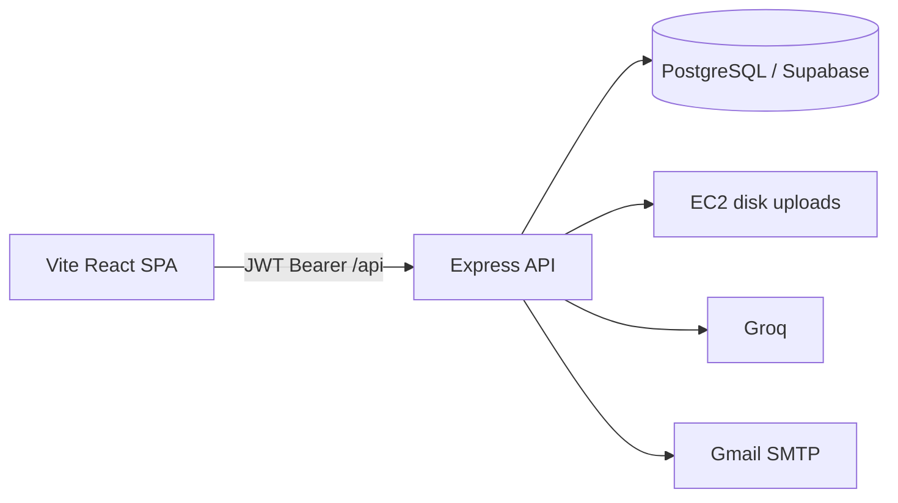

<p align="center">
  
</p>

<h1 align="center">LamarKerja AI</h1>

<p align="center">
  <strong>A job-search cockpit for Indonesian candidates</strong><br>
  Aggregate recent vacancies, draft applications with Groq, track a real pipeline, and send mail from your own Gmail.
</p>

<p align="center">
  
  
  
  
  
</p>

<p align="center">
  Built by <a href="https://github.com/malthafkiram">M. Althaf Kiram</a>
  · <a href="https://github.com/malthafkiram/LamarKerja-AI">Repository</a>
</p>

---

LamarKerja is a full-stack product, not a CRUD demo. It is the workspace I actually use to hunt roles: one hub for **fresh listings**, **AI-assisted writing**, **interview drill**, and a **personal CRM** — without pretending to auto-apply on LinkedIn or scrape boards that block public access.

> [!NOTE]
> Apply links always go to the **official posting**. There is no unofficial Glints / JobStreet / Indeed / Kalibrr live scrape. SMTP App Passwords stay on **your** server profile and are **not** sent to Groq.

## Why it exists

Indonesian job search is fragmented (local boards, remote APIs, WhatsApp flyers, Gmail). Most “AI apply” tools either hallucinate Easy Apply or store mail credentials opaquely. LamarKerja keeps the loop honest: **ingest → match → draft → you send → you track**.

## What you can do

| Area | What ships |
| --- | --- |
| **Job hub** | Multi-source directory with an **8-day ingest / 18-day purge** window so the list stays current |
| **Globe** | 3D map of remote roles (Remotive, Arbeitnow, Jobicy, Himalayas, Remote OK) |
| **News** | Hiring & internship articles via **Google News RSS** (not HTML scrape of news sites) |
| **CRM** | Pipeline: Draft → Sent → Interview → Offering → Hired / Rejected, plus a follow-up flag after 5 days |
| **CV & ATS** | Groq STAR polish, A4 PDF export, ATS score / keyword gaps |
| **Drop & Send** | OCR a flyer, extract HR contact, draft a letter, send through **your Gmail App Password** |
| **Prep** | Live Code Arena, interview simulator, salary briefing, anti-scam scan, company intel |

**Sources in the hub:** LinkedIn guest HTML (Indonesia), Dealls, Disnakerja, KarirJakarta, Karirhub Kemnaker, Toploker, Karirlink, plus the remote APIs above.

## Architecture



| Layer | Choice | Why |
| --- | --- | --- |
| UI | React 19 + Vite | SPA, proxied `/api` in dev |
| API | Express + Sequelize | Long job/news sync, OCR, mail — not a 10s lambda |
| DB | PostgreSQL (local or Supabase) | ARRAY / JSONB profiles; SSL for Supabase session pooler `:5432` |
| Files | Disk on one Node process | CVs stay off Vercel; one CV per user; flyers deleted after OCR |
| AI | Groq | Drafts and audits; never receives SMTP passwords |
| Auth | JWT + bcrypt | First register is admin |

**Deploy:** one **Railway** web service (Express serves `client/dist`), Postgres on **Supabase**, CVs on a volume at `/app/uploads`. AWS is not required.

## Stack

**Client:** React, Vite, globe.gl, Lucide  
**Server:** Express, Sequelize, PostgreSQL, Multer, Tesseract.js, Nodemailer, Cheerio  
**Infra:** Railway (or PM2 + Nginx), Groq API

## Repository layout

```
LamarKerja-AI/
├── client/          # Vite app  →  npm run dev  (port 3000)
├── server/          # Express   →  npm run dev  (port 5000)
└── uploads/         # created at runtime, gitignored
```

## Quick start

**Requirements:** Node.js 20+, PostgreSQL, a [Groq API key](https://console.groq.com/keys).

```bash
git clone git@github.com:malthafkiram/LamarKerja-AI.git
cd LamarKerja-AI
```

**Database** — create `lamarkerja` and set `DATABASE_URL` in `server/.env` (copy `server/.env.example`).

**API**

```bash
cd server
cp .env.example .env   # then edit
npm install
npm run dev
```

**Web**

```bash
cd client
cp .env.example .env   # leave VITE_API_URL empty for the Vite proxy
npm install
npm run dev
```

Open [http://localhost:3000](http://localhost:3000). The first registered account is **admin**.

> [!IMPORTANT]
> For local dev, run scripts from `server/` and `client/`. After a fresh clone you must `npm install` in **both** folders. Railway uses the **root** `package.json` (`npm run build` / `npm start`).

### Environment (short)

| Variable | Where | Role |
| --- | --- | --- |
| `DATABASE_URL` | server | Postgres. Supabase: **session pooler port 5432** + `sslmode=require` (not 6543) |
| `JWT_SECRET` | server | Required in production; rejected if left as a known default |
| `GROQ_API_KEY` | server | Model calls |
| `CLIENT_URL` | server | CORS allowlist (public site origin, e.g. Railway URL) |
| `VITE_API_URL` | client | Absolute API host when the SPA is not same-origin |

Gmail sending uses a **16-character App Password** on the user profile, not the Google account password.

## Deploy on Railway

Skip AWS for this app. Railway runs a real Node process (job sync can take minutes) and can keep CV files on a volume.

1. Push `main` to GitHub (already the case).
2. [Railway](https://railway.app) → **New project** → **Deploy from GitHub** → `malthafkiram/LamarKerja-AI`.
3. **Variables** (do not commit these):

| Key | Value |
| --- | --- |
| `NODE_ENV` | `production` |
| `JWT_SECRET` | long random string (not a known default) |
| `GROQ_API_KEY` | Groq key |
| `DATABASE_URL` | Supabase **session pooler `:5432`** + `?sslmode=require` |
| `CLIENT_URL` | your public Railway URL, `https://….up.railway.app` (set after the first deploy if needed) |

Railway injects `PORT`. Leave `VITE_API_URL` empty so the SPA calls same-origin `/api`.

4. **Volume** (wajib kalau Root Directory = `server`):
   - Railway → service → **Volumes** → Add
   - **Mount path:** `/app/uploads`  
     (itu folder `server/uploads` di dalam container; Multer menulis CV ke situ)
   - Optional variable: `UPLOAD_DIR=/app/uploads` (sama dengan default)
   - Tanpa volume, file CV hilang setiap redeploy

Kalau Root Directory = `server`, folder `client/` **tidak ikut**. SPA harus di Vercel (`VITE_API_URL` = URL Railway) **atau** ganti Root ke repo (bukan `server`) supaya UI ikut di-build.
5. Generate a public domain. Health check is `GET /api/health`.
6. First register on that URL is **admin**.

> [!WARNING]
> Do not use Railway Postgres **and** forget Supabase if `DATABASE_URL` still points at Supabase — pick one database. Job hub sync needs a **proxy timeout well above 30s**; if a deploy looks “stuck”, it is often still ingesting listings.

## Engineering notes (portfolio)

Decisions I would defend in an interview:

- **Recency over dump.** Ingest last 8 days, drop jobs older than ~18 days. A hub full of stale ads is worse than a smaller list.
- **No fake apply URLs.** Boards that 403 or only expose search pages are omitted rather than linked as “Easy Apply”.
- **Disk hygiene.** Flyers are unlinked after OCR. A second CV upload is **409** until the user deletes the first — so one EC2 volume does not fill with orphans.
- **Honest security copy.** SMTP secrets are stored for send-mail on the operator’s server; the product does not claim SOC 2 or app-password encryption it does not implement.
- **Process shape.** Job sync is a long-running Node job. That is why production is Railway or a VM, not a 10-second serverless function.

## Tests

```bash
cd server && npm test
cd client && npm test
```

## Author

**M. Althaf Kiram** — full-stack project spanning product design, ingestion, AI UX, and production constraints (CORS, cookies, uploads, managed Postgres).

- GitHub: [malthafkiram](https://github.com/malthafkiram)
